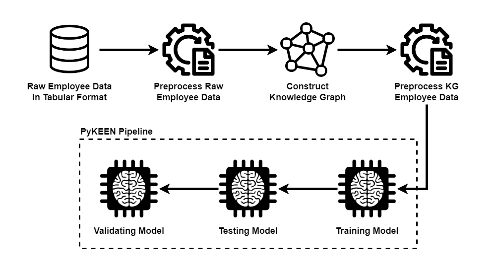

# Beyond Benchmarks: Assessing Knowledge Graph Completion Methods on Non-Benchmark Employee Data

This repository hosts the code and data for the paper titled "Beyond Benchmarks: Assessing Knowledge Graph Completion Methods on Non-Benchmark Employee Data," accepted at the International Conference on Data Science and Its Applications (ICoDSA) 2024. The research investigates the performance of Knowledge Graph Completion (KGC) methods—TransE, ComplEx, and TransH—on a non-benchmark employee dataset within the Human Resources (HR) domain. While existing studies primarily focus on benchmark datasets, this research aims to bridge the gap by evaluating KGC methods in real-world HR scenarios. By providing insights into the adaptability and efficacy of these methods beyond traditional benchmarks, this study contributes to a deeper understanding of KGC methods' performance within industry-specific applications.

## Installation

To run the Python program associated with this repository, follow these steps:

1. Choose a directory on your local machine where you want to store the repository.

2. Clone this repository to your chosen directory using the following command:

    ```bash
    git clone https://github.com/khalidhabiburahman/kgc-non-benchmark-employee.git
    ```

3. Navigate to the cloned repository directory in your command prompt/terminal/local machine. For example, if you have cloned the repository into a folder named `my-project`, you can navigate to it using the `cd` command:

    ```bash
    cd path/to/my-project
    ```

4. Once you are in the repository directory, install the required Python libraries listed in the `requirements.txt` file using pip:

    ```bash
    pip install -r requirements.txt
    ```

This command will install all the necessary dependencies, including pandas, numpy, scikit-learn, matplotlib, rdflib, pathlib, and torch, ensuring that the program runs smoothly on your system.

## Run the Experiments


To reproduce the experiments conducted in this research, follow the steps outlined below:

### 1. Raw Employee Data in Tabular Format
The raw employee data in tabular format serves as the initial input for the experiments. This file can be found in the folder [`Dataset/raw_tsel/diffbot-tsel-emp-export.csv`](Dataset/raw_tsel/diffbot-tsel-emp-export.csv). 

### 2. Preprocess Raw Employee Data
Preprocessing of the raw employee data is performed using the [`raw_tsel_preprocess.ipynb`](raw_tsel_preprocess.ipynb) notebook.

### 3. Construct Knowledge Graph
The construction of the knowledge graph involves the use of OntoText Refine. Download the tool and import the project file [`kg_tsel_emp.openrefine.tar.gz`](kg_tsel_emp.openrefine.tar.gz) to observe the process of constructing the knowledge graph.

### 4. Preprocess KG Employee Data
Further preprocessing of the knowledge graph employee data is carried out using the [`kg_tsel_preprocess.ipynb`](kg_tsel_preprocess.ipynb) notebook.

### 5. Training, Testing, and Validation Model
Training, testing, and validation of the model are conducted using the [`kgc_tsel.ipynb`](kgc_tsel.ipynb) notebook. All these processes are encapsulated within a single notebook as the PyKEEN Pipeline is utilized for seamless execution.

By following these steps and executing the provided notebooks, you can replicate the experiments and analyze the results of the research.

**Please note that this experiment utilizes Google Colab, which may require mounting to Google Drive for accessing the datasets. If this is not necessary for your setup, feel free to skip the code snippet related to mounting the drive.**

## Citation
If you use this package for published work, please cite the paper. Here is the BibTeX:

```bash
Yet to be published
```

## License
This project is licensed under the Apache License 2.0 - see the [LICENSE](LICENSE) file for details.
